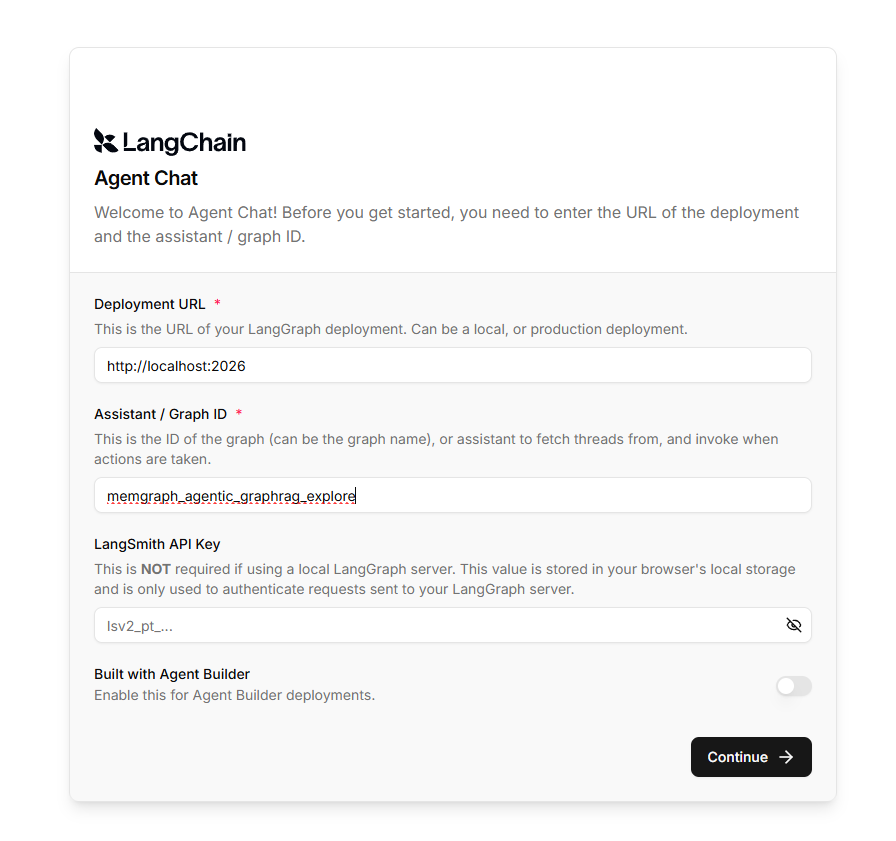
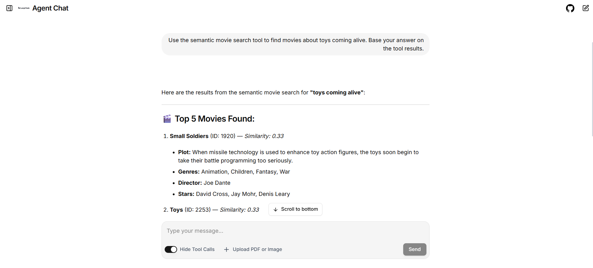

# Memgraph Agentic GraphRAG

This is an exploration project for learning agentic GraphRAG with Memgraph and
LangChain. It uses the
[Neo4j Movie Recommendations dataset](https://github.com/neo4j-graph-examples/recommendations),
which is restored into Neo4j and then migrated to Memgraph.

The agent provides two tools:

- `search_movies` performs semantic movie search with Memgraph's vector index.
- `query_movie_graph` generates and runs read-only Cypher against Memgraph.

## Project structure

- `src/agent/`: agent graph, tools, prompts, configuration, and migration code
- `scripts/`: dataset download and Neo4j restore utilities
- `tests/`: unit tests and live agent integration tests
- `compose.db.yml`: Neo4j and Memgraph services used during migration
- `docker-compose.yml`: Memgraph, PostgreSQL, Redis, and the Aegra API
- `aegra.json`: Aegra graph configuration

## Requirements

- Docker with Docker Compose
- Python 3.13
- [uv](https://docs.astral.sh/uv/)
- Bash, Git, and Git LFS
- An [OpenRouter](https://openrouter.ai/) API key

## Setup

### 1. Configure the project

```sh
uv sync
cp .env.example .env
```

Set `NEO4J_PASSWORD` and `OPENROUTER_API_KEY` in `.env`. Other model,
embedding, and database settings can also be changed there.

### 2. Load the dataset into Neo4j

```sh
bash scripts/load-recommendations.sh --replace
```

The loader downloads the dataset with Git LFS, restores it into this project's
Neo4j volume, and starts Neo4j. Downloads are cached under
`.datasets/recommendations`.

> **Warning:** This replaces the local Neo4j `neo4j` database.

### 3. Migrate the graph to Memgraph

```sh
docker compose -f compose.db.yml up -d memgraph
uv run migrate-recommendations --replace
```

The migration copies all nodes, relationships, labels, types, and properties,
then verifies the source and target counts.

> **Warning:** `--replace` clears existing graph data in Memgraph.

### 4. Create the Memgraph embeddings

The source dataset does not include the 2048-dimensional Nemotron embeddings
used by this project. Generate them and build the vector index with:

```sh
uv run backfill-memgraph-embeddings
```

The command skips existing embeddings, so it can be resumed if interrupted.
After it finishes, Neo4j is no longer needed:

```sh
docker compose -f compose.db.yml stop neo4j
```

### 5. Run the application

Run Aegra locally with hot reload:

```sh
docker compose up -d postgres memgraph
uv run aegra dev
```

Aegra loads `.env` and applies PostgreSQL migrations automatically.

Alternatively, run the complete stack in Docker:

```sh
docker compose up -d --build
```

This starts Memgraph, PostgreSQL, Redis, and the Aegra API. Neo4j remains
stopped unless the `migration` profile is enabled. Compose changes the Aegra
database host from `localhost` to the `postgres` service automatically.

### 6. Chat with the agent

After Aegra is running, you can interact with the agent through
[LangChain Agent Chat UI](https://github.com/langchain-ai/agent-chat-ui). In
the connection form, use:

- Deployment URL: `http://localhost:2026`
- Assistant / Graph ID: `memgraph_agentic_graphrag_explore`

A LangSmith API key is not required when connecting to the local Aegra server.



You can then chat with the agent and inspect its answers and tool calls:



## Data persistence

Neo4j and Memgraph use Docker volumes. Normal restarts and
`docker compose down` preserve their data. Running `docker compose down -v`
deletes the volumes and their data.

## Safety or Guardrails

Generated Cypher is limited to one read-only statement. Mutation,
administration, procedure, and `LOAD CSV` clauses are rejected before the query
is sent to Memgraph.

## Tests

Run the unit tests:

```sh
uv run pytest
```

These tests mock database and model calls, so they do not require Docker or an
OpenRouter API key.

The live integration test in
[`tests/integration_tests/test_agent.py`](tests/integration_tests/test_agent.py)
checks both semantic search and text-to-Cypher against the loaded Memgraph data.
Complete the setup, keep Memgraph running, and set `OPENROUTER_API_KEY` before
running:

```sh
RUN_LIVE_AGENT_TESTS=1 uv run pytest -s tests/integration_tests/test_agent.py
```

## References

- [Vector Search in Memgraph](https://memgraph.com/vector-search)
- [LangChain Memgraph integration](https://github.com/memgraph/ai-toolkit/tree/main/integrations/langchain-memgraph)
